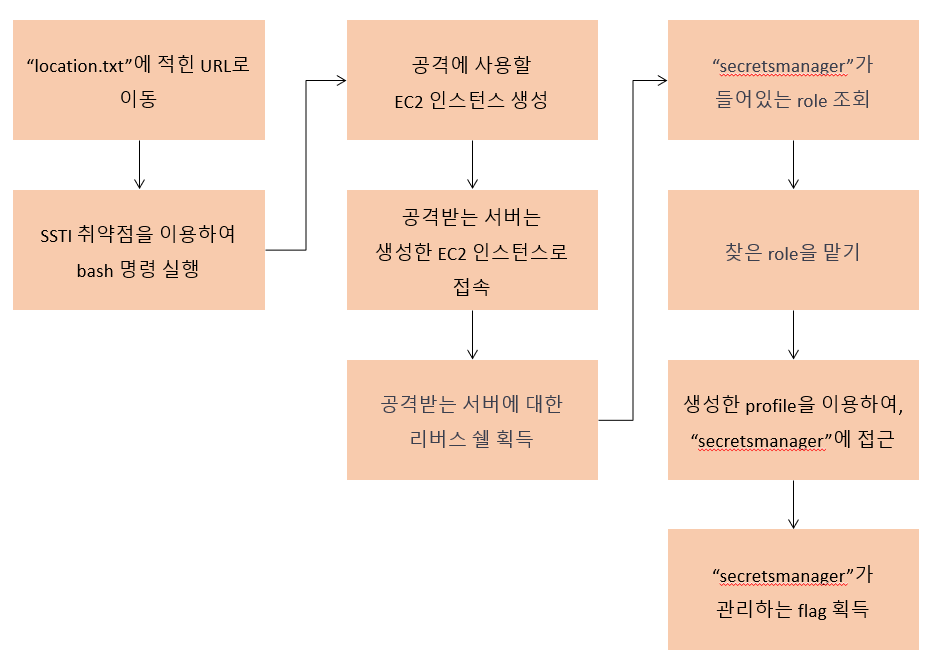

# Scenario: Command Injection

**Size:** Small

**Difficulty:** Easy

**Command:** `$ cd ./terraform; terraform init; terraform apply`

## Scenario Resources

* EC2 x 1
* Secret x 1

## Start of Scenario

- Public IP Address of an EC2 server which runs a web application
- `./terraform/location.txt`: contains Public IP Address above

## Scenario Goal(s)

Get flag managed by AWS secretsmanager.

## Summary

You start as an outsider. Exploit web application vulnerable to SSTI using reverse shell. Enumerate and assume iam role to access secretsmanager. Use srcretsmanager to retrieve flag.

## Exploitation Route(s)

## Route Walkthrough - Anonymous

1. You stumble upon a web application, which is vulnerable to SSTI
2. Use SSTI vulnerability to run bash commands
3. Use reverse shell to obtain access to web application's server.
4. Search iam role which possesses `secretsmanager` as policy.
5. Assume role found above
6. Enumerate through secrets managed by secretsmanager to find flag
7. Get flag with flag's arn

A cheat sheet for this route is available [here](./cheatsheet.md).